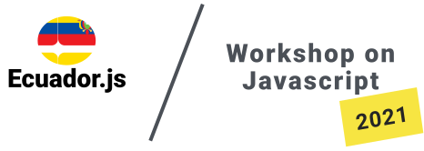

# Workshop on Javascript 2021

Este template nos sirve para el sitio del evento Workshop on Javascript 2021.
Es necesario usar gulp para construir y minificar todos los archivos.
Hasta ahora lo que esta en el dist es lo que se ha construido.
! Si podemos cambiar la forma de construir usando webpack o algo parecido seria chevere.

[Papaya](https://www.papayatemplates.com)
[@jrdnbwmn](https://www.twitter.com/jrdnbwmn)

Demo images from [Unsplash](https://unsplash.com/).
Icons from [Entypo](http://entypo.com/).

## Instructions
For local development, run `npm install` on the main directory and then `gulp` to get BrowserSync going along with all the Gulp tasks (see [Pear](https://github.com/jrdnbwmn/Pear)).

Development files are in `src`. Everything is compiled into `dist`—that’s where all your final files reside.